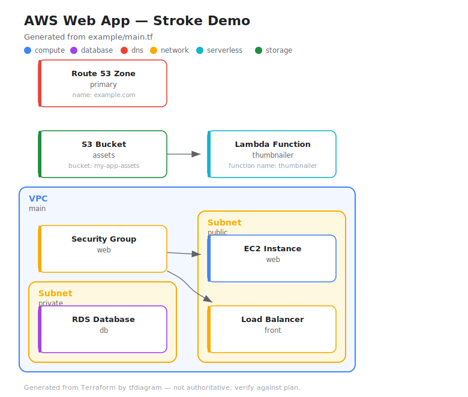

# tfdiagram

Scan a Terraform codebase and generate a styled SVG architecture diagram.
Graphviz computes the layout; the SVG is hand-rendered for a clean,
card-based look (no ugly default `dot` output).



## Why not just use `terraform graph` or the existing tools?

There are other ways to draw Terraform. Here's why this exists.

**vs. `terraform graph | dot -Tsvg` (the built-in)**
It draws a *dependency* graph for debugging, not an architecture diagram. It
dumps every provider, variable, `meta.count-boundary` and `root` node, renders
plain graphviz ellipses with no grouping or color, and needs `terraform init`
first. tfdiagram shows only your real resources, reads source directly (no
init/state), groups them by VPC/subnet, and styles them.

**vs. `inframap`, `rover`, `blast-radius`, `pluralith`**
These are good, but: most render from **state/plan** (so you need a real,
applied infra or a plan file), several are heavyweight (a running web server,
a Go toolchain, or a paid SaaS), and their visual output is fixed — you take
the look they give you. tfdiagram is one small dependency-free Python package
that reads **static `.tf` source**, and because it renders the SVG itself, the
output is fully styleable (cards, category colors, your own `--color`).

**The core idea**
Layout is the hard part, so graphviz still does it — but only the *math*
(`dot -Tjson` gives coordinates, nothing is drawn by dot). tfdiagram then
emits its own SVG: rounded white cards with category-colored accents, tinted
nested VPC/subnet containers, a legend, and routed arrows. You get graphviz's
proven layout with a hand-designed look instead of graphviz's default render.

So: **static-source-driven, zero runtime deps, and restyleable** — that's the
niche the others don't fill all at once.

## Requires

- Python 3.10+
- [Graphviz](https://graphviz.org) (`dot` on PATH) — layout only

## Use

```bash
python3 -m tfdiagram path/to/terraform -o infra.svg
python3 -m tfdiagram example --title "AWS Web App"
python3 -m tfdiagram example --color database=#c62828   # recolor by type
python3 -m tfdiagram example --dot                       # dump layout DOT
```

## How it works

```
tfdiagram/
  parser.py    scan *.tf -> resources, attrs, edges, VPC/subnet nesting
  model.py     Resource / Graph dataclasses
  style.py     category colors, pretty labels, container tints
  layout.py    feed sized boxes to `dot -Tjson`, read back coordinates
  render.py    emit the styled SVG (cards, groups, arrows, legend)
  __main__.py  CLI
```

Resources are colored by category (compute / database / storage / network /
serverless / dns). Anything referencing a subnet/VPC is nested inside it.

## Test

```bash
python3 -m tests.test_parser
python3 -m tests.test_render   # needs graphviz
```

## Limitations

Regex HCL parse (not a real parser), no `count`/`for_each` fan-out, geometric
cards rather than vendor icons. Containment covers AWS/GCP/Azure VPC+subnet —
extend `CONTAINERS` in `style.py` for more.
